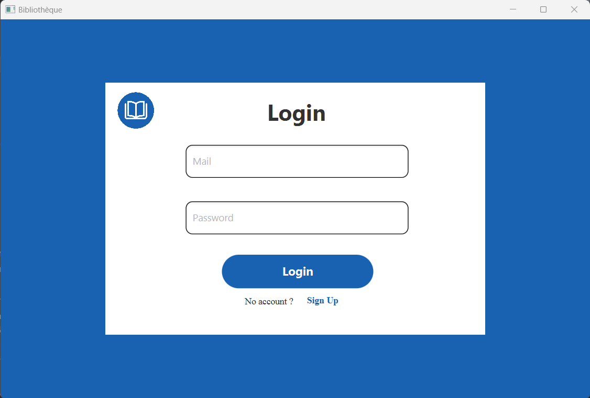
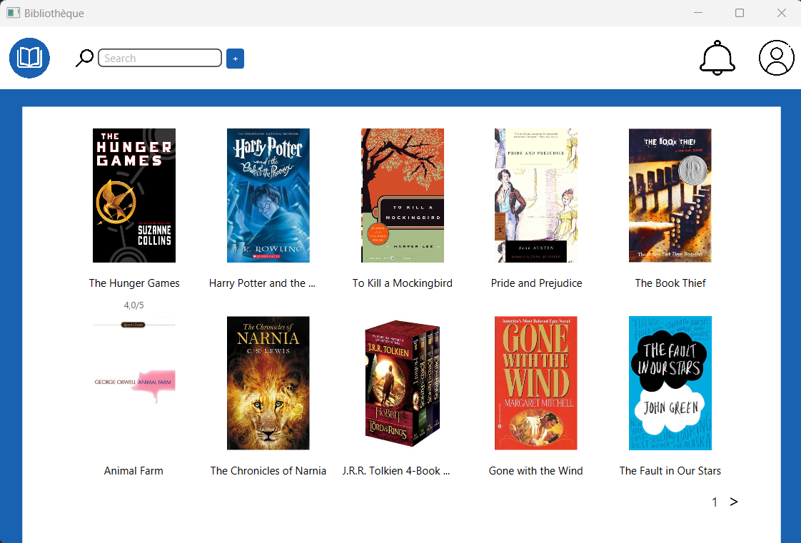
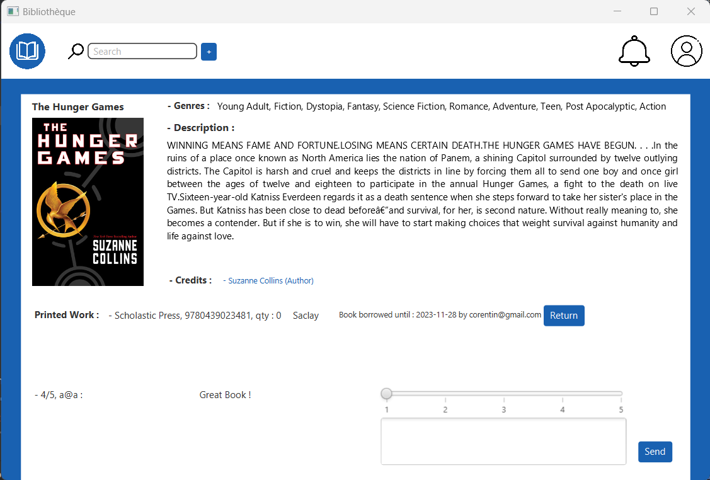
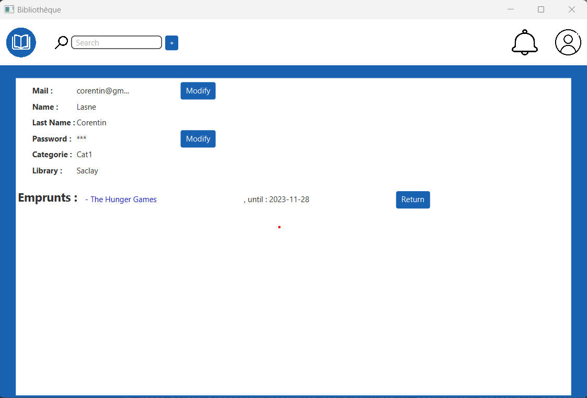
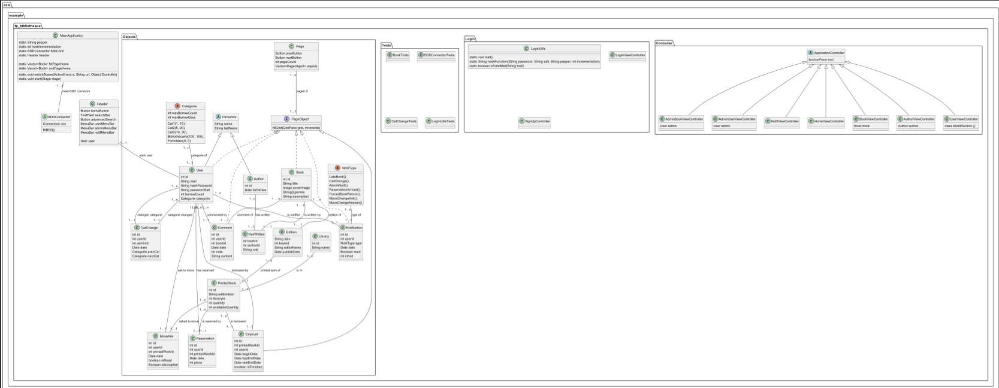

# Library Management System (2023)


⚠️ This project is a school project ⚠️

## Overview

This Java application simulates a library management system coded from scratch, featuring user authentication, book management, and administrative functionalities. The project utilizes JavaFX and CSS for the graphical user interface, ensuring a seamless and intuitive user experience. The security of user credentials is implemented with hashing, using both salt and pepper techniques.

## Features

1. **User Authentication and Registration:**
    - Secure login and registration with hashed passwords, salt, and pepper.
    - User account information stored securely.

2. **Book Management:**
    - View the books available in your library.
    - Borrow and return books.
    - Request to change the location of a book (e.g., from another library).
    - Reserve a book if it is currently borrowed by another user.

3. **User Account Management:**
    - View and modify account information.
    - Receive notifications for overdue books or status updates.

4. **Administrator Privileges:**
    - Perform all user functionalities.
    - Move books between locations.
    - Add new books to the database.
    - Force return of a book by a user.
    - Change user categories, affecting borrowing limits and durations.
    - Receive specific notifications, such as relocation requests.

5. **Notification System:**
    - Users receive notifications for overdue books or status changes.
    - Administrators receive relocation requests and can accept or reject them.

## Screenshots

### Authentication Screen
<p align="center">
	
</p>

### Home Screen
<p align="center">
	
</p>

### Book Screen
<p align="center">
	
</p>

### User Screen
<p align="center">
	
</p>

### Class Diagram
<p align="center">
	
</p>

## Technologies Used

- Java SDK 17
- JavaFX
- IntelliJ IDEA
- CSS
- MySQL

## Getting Started

1. Clone the repository to your local machine.
2. Open the project in IntelliJ IDEA.
3. Set up the project SDK to Java 17.
4. Build and run the application.

### Database Configuration

Before launching the application, follow these steps to configure the MySQL database:

1. Create a MySQL database and tables by executing the SQL scripts provided in the `src/main/resources/com/example/tp_bibliotheque/bdd` directory. These scripts contain the necessary schema for the application.

2. Open the `BDDConnector.java` file located in `/src/main/java/com/example/tp_bibliotheque`. This file manages the database connection.

3. Modify the connection parameters in the `BDDConnector.java` file to match your MySQL database configuration:

   ```java
   // BDDConnector.java
   
   con = DriverManager.getConnection("jdbc:mysql://your-mysql-server:3306/your-database", "your-username", "your-password");
   ```

## Getting Started

- Project developed by Guillaume DI FATTA
